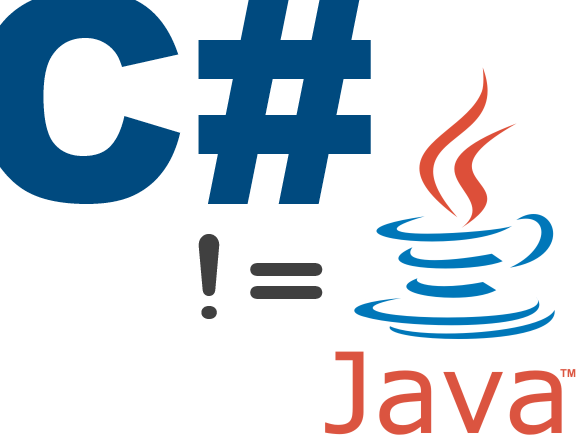

Overview
===========

CSharpKatas is a training tool for teaching C# newcommers how to apply advanced language features, how to write idiomatic
C#, and most importantly how to avoid Java idioms in C#.

C# Isn't Java
===========

This project was created in response to overhearing numerous developers exclaim that "C# is just like Java".  It 
was also created to get those with a background in an OO language like Java up to speed and writing idiomatic C# 
as quickly as possible.  

For more background see the related [blog post series](http://rapidapplicationdevelopment.blogspot.com/2013/10/c-isnt-java-learning-via-katas-part-1.html).

Katas
===========

The exercises here are organized into Katas, or mind excersises.  Developers are asked to turn the tests green 
using any means necessary, then refactor using C# idioms (such as not writing loops or if statements without 
good reason).

Perhaps along the way developers will become convinced of how wonderful TDD and Red-Green-Refactor is, but 
that's incidental.

Anyone wishing to work on these problems is encouraged to create a branch and work the solutions there.  

Anyone who
is unable to solve a Kata in under a few minutes is encouraged to delete their solution and re-solve it until the
solution is second-nature.
